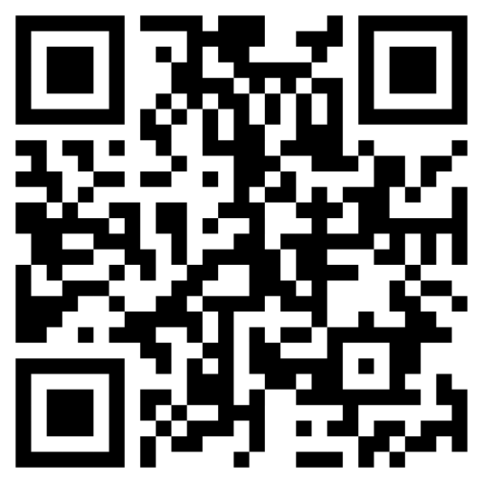
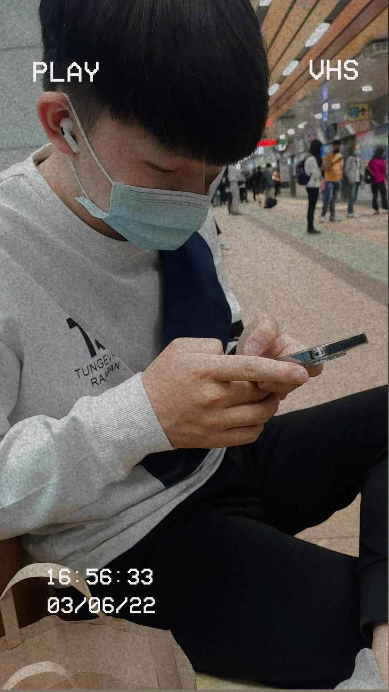

# 11302
智慧城市導論

|項次|項目|內容|
|----:|------|------|
|1 | 圖片 ||
|2 | 姓名 |薛宇翔|
|3 | 職稱 |學生|
|3 | 任職公司 |高雄科技大學|

<a href="https://www.youtube.com/watch?v=LCVVs4O7W8g" target="_blank">傳說對決</a> 

 影片取自 youtube

## 高雄智慧城市展

(一)、 展出日期：2026年3月19日（日）至3月22日（三），共4天 
(二)、 展出地點：高雄展覽館（高雄市前鎮區成功二路39號） 
(三)、 參展區域： 
  
|物聯網應用(5G AIoT)	| 智慧交通 | 智慧治理 | 智慧建築 |
|-------------------|---------|----------|---------|
|智慧安防 | 智慧醫療 | 智慧教育 |  智慧金融 |
|智慧能源 | 新創	   | AI+專區  |-----------|	

(四)、 參展解決方案 
物聯網應用 
|智慧交通：| 自動駕駛、智慧公車、智慧車隊、智慧航運、智慧停車、智慧載具、智慧運輸、智慧物流、智慧倉儲|
|---------|---------------------------------------------------------------------------------|
|智慧治理：| 智慧政府、智慧港務、智慧稅務、智慧警政|
|智慧建築：| 智慧物業、智慧社區、智慧門禁、智慧家庭、智慧園區、智慧辦公室、智慧溫室、智慧農漁業|
|智慧安防：| 智慧杆、智慧路燈、智慧水務、智慧水質監測、智慧觀光、智慧安防、智慧防救災、智慧感測|
|智慧醫療：| 健康促進、智慧穿戴、智慧照護、智慧醫院、遠距照護、遠距醫療、智慧防疫|
|智慧教育：| 智慧校園、智慧教室、遠距教學|
|智慧金融：| 智慧支付、智慧零售、無人商店|
|智慧能源：| 智慧能源、智慧創能、智慧節能、智慧儲能、智慧電網、智慧電表|
|AI+專區  ||
|其他     ||

